# RFC 0001: POC Scope & Milestones

- **Status**: Accepted
- **Authors**: Kaustav Das Modak, Claude
- **Created**: 2025-02-05

## Summary

Defines the scope, deliverables, and milestones for the Prolly proof of concept (POC). The POC is a fully local-first, single-user PWA demonstrating core functionality.

## Goals

1. Validate the local-first architecture
2. Establish keyboard-driven UX patterns
3. Build core entity CRUD and relationships
4. Create foundation for future sync and collaboration
5. Demonstrate proof of learning concept (basic report)

## Non-Goals (Deferred)

- User authentication / accounts
- Cloud sync
- Multi-device support
- Collaboration / multi-user
- Public profiles / sharing
- Go backend implementation (model definitions only)

## Scope

### In Scope

| Feature | Description |
|---------|-------------|
| Local storage | All data in IndexedDB via Dexie |
| PWA | Installable, offline-capable |
| Personal space | Implicit space for single user |
| Curriculum management | Create, edit, delete curricula |
| Objective tracking | CRUD + prerequisite relationships (DAG) |
| Lessons | Create and link to objectives |
| Projects | Create with milestones, link to objectives |
| Activities | Append-only log of learning events |
| Observations | Self-observations and notes |
| Notes | Freeform capture |
| Reflections | Periodic reflection with templates |
| Progress tracking | Mark objectives as in-progress/achieved |
| Basic report | Simple proof of learning output |
| Keyboard navigation | Full keyboard control |
| Command palette | Quick access to all actions |
| Responsive design | Desktop, tablet, mobile |
| Dark mode | System preference + manual toggle |

### Out of Scope

- Feedback (requires multiple users)
- Memberships/roles (single user)
- Sync queue (no backend)
- File attachments beyond images (POC simplification)
- External standard alignment (future)
- Rich text editing (use markdown for POC)

## Information Architecture

```mermaid
graph TD
    Home[Home]

    Home --> Dashboard
    Dashboard --> RecentActivity[Recent Activity]
    Dashboard --> ActiveProjects[Active Projects]

    Home --> Curricula
    Curricula --> CurriculumList[Curriculum List]
    Curricula --> CurriculumDetail[Curriculum Detail]
    CurriculumDetail --> ObjectivesTree[Objectives Tree/DAG]
    CurriculumDetail --> LinkedLessons[Linked Lessons]

    Home --> Objectives
    Objectives --> ObjectiveList[All Objectives]
    Objectives --> ObjectiveDetail[Objective Detail]
    ObjectiveDetail --> Prerequisites
    ObjectiveDetail --> Progress

    Home --> Lessons
    Lessons --> LessonList[Lesson List]
    Lessons --> LessonDetail[Lesson Detail]

    Home --> Projects
    Projects --> ProjectList[Project List]
    Projects --> ProjectDetail[Project Detail]
    ProjectDetail --> Milestones

    Home --> Journal[Journal]
    Journal --> Timeline[Timeline View]
    Journal --> NewEntry[New Entry]

    Home --> ProgressView[Progress]
    ProgressView --> Overview
    ProgressView --> Report[Report Generation]

    Home --> Settings
    Settings --> Profile
    Settings --> Appearance
    Settings --> Shortcuts[Keyboard Shortcuts]
```

## Milestones

### M1: Foundation

**Deliverables:**
- SvelteKit project scaffold
- Dexie database setup with core schemas
- TypeScript model definitions
- PWA configuration (service worker, manifest)
- Basic routing structure

**Acceptance:**
- App installs as PWA
- Works offline after first load
- Can store and retrieve data from IndexedDB

### M2: Command System

**Deliverables:**
- Command registry implementation
- Keyboard action system (modal keys)
- Command palette component
- Help overlay (`?` key)
- Focus management

**Acceptance:**
- Can navigate app entirely via keyboard
- Command palette opens with `Cmd/Ctrl+K`
- `?` shows available commands
- Escape returns to normal mode

### M3: Core Entities

**Deliverables:**
- User profile (local)
- Space (implicit personal space)
- Curriculum CRUD
- Objective CRUD with prerequisites
- Lesson CRUD with objective linking
- Project CRUD with milestones

**Acceptance:**
- Can create, edit, delete all core entities
- Objectives show prerequisite relationships
- Lessons/Projects link to objectives

### M4: Tracking & Evidence

**Deliverables:**
- Activity logging (automatic on actions)
- Observations CRUD
- Notes CRUD
- Reflection templates and responses
- Progress tracking on objectives

**Acceptance:**
- Activities recorded automatically
- Can write observations and notes
- Can complete reflections
- Can mark objectives as achieved

### M5: Views & Reports

**Deliverables:**
- Dashboard view
- Curriculum/objective tree view
- Activity timeline
- Progress overview
- Basic proof of learning report

**Acceptance:**
- Dashboard shows meaningful summary
- Can visualize curriculum structure
- Can review activity history
- Can generate simple progress report

### M6: Polish

**Deliverables:**
- Responsive refinements
- Dark mode
- Settings persistence
- Error handling
- Empty states
- Loading states
- Onboarding/first-run experience

**Acceptance:**
- Works well on mobile, tablet, desktop
- Smooth theme switching
- Graceful handling of edge cases
- New user understands how to start

## Technical Decisions

### Confirmed

| Decision | Choice | Rationale |
|----------|--------|-----------|
| Framework | Svelte 5 + SvelteKit | Runes, compiled, small bundle |
| Local storage | Dexie | Clean API, TypeScript, migrations |
| Styling | CSS custom properties + utility classes | Simple, no build dependencies |
| IDs | UUIDv7 | Time-sortable, offline-friendly |
| PWA | vite-plugin-pwa | Standard, well-maintained |

### To Decide

| Decision | Options | Notes |
|----------|---------|-------|
| Icon set | Lucide / Heroicons / Custom | Evaluate bundle size, coverage |
| Markdown rendering | marked / mdsvex / custom | For lesson content |
| Date handling | date-fns / dayjs / native | Evaluate bundle size |
| Testing | Vitest + Testing Library | Likely choice |

## Success Criteria

The POC is successful if:

1. **Functional**: All in-scope features work correctly
2. **Offline**: Complete functionality without network
3. **Keyboard-driven**: Power users can work without mouse
4. **Responsive**: Usable on all screen sizes
5. **Performant**: No perceptible lag in interactions
6. **Installable**: Works as installed PWA

## Risks & Mitigations

| Risk | Mitigation |
|------|------------|
| IndexedDB storage limits | Track usage, implement cleanup |
| Complex DAG visualization | Start simple (list with indent), iterate |
| Keyboard conflicts | Document conflicts, allow customization later |
| Scope creep | Strict adherence to POC scope |

## Alternatives & Tradeoffs

### Local-First vs Server-First

**Chosen**: Local-first with optional sync

| Approach | Pros | Cons |
|----------|------|------|
| Local-first | Works offline, instant UI, privacy by default, no server costs for POC | Complex sync later, storage limits, no cross-device without sync |
| Server-first | Simpler data model, cross-device by default, easier backup | Requires connectivity, server costs, latency, privacy concerns |

**Rationale**: Learning happens everywhere—commutes, classrooms without wifi, remote areas. Local-first ensures the tool is always available.

### Svelte vs React/Vue

**Chosen**: Svelte 5

| Framework | Pros | Cons |
|-----------|------|------|
| Svelte 5 | Compiled (small bundles), runes are intuitive, less boilerplate | Smaller ecosystem, fewer developers familiar |
| React | Large ecosystem, many devs know it, extensive tooling | Runtime overhead, more boilerplate, bundle size |
| Vue | Good balance, reactive by default | Smaller ecosystem than React, Options vs Composition API split |

**Rationale**: PWA bundle size matters. Svelte's compiled output and Svelte 5's runes provide excellent DX with minimal overhead.

### Dexie vs PouchDB vs Raw IndexedDB

**Chosen**: Dexie

| Option | Pros | Cons |
|--------|------|------|
| Dexie | Clean API, TypeScript, migrations, performant | Another dependency |
| PouchDB | Built-in CouchDB sync | Opinionated sync model, heavier |
| Raw IndexedDB | No dependencies | Verbose, error-prone, no migrations |

**Rationale**: We want custom sync logic, not CouchDB replication. Dexie provides the best DX without sync opinions.

### Single PWA vs Electron/Tauri

**Chosen**: PWA only (for POC)

| Approach | Pros | Cons |
|----------|------|------|
| PWA | Cross-platform, no install friction, web standards | Limited native APIs, storage quotas |
| Electron | Full native access, no storage limits | Large bundle, separate builds |
| Tauri | Smaller than Electron, Rust backend | Additional complexity, separate builds |

**Rationale**: PWA covers the POC use case. Native wrappers can be added later if needed.

## Dependencies

This RFC is the foundation. The following draft RFCs provide detailed specifications:

- **project-architecture**: System architecture and technology choices
- **data-model**: Entity definitions and relationships
- **local-first-storage**: Dexie schema and offline strategy
- **ui-ux-design-system**: Visual design and interaction patterns

## Next Steps

1. Finalize and accept dependent RFCs
2. Initialize SvelteKit project (M1)
3. Implement command system (M2)
4. Build core entities (M3)
5. Iterate based on usage
