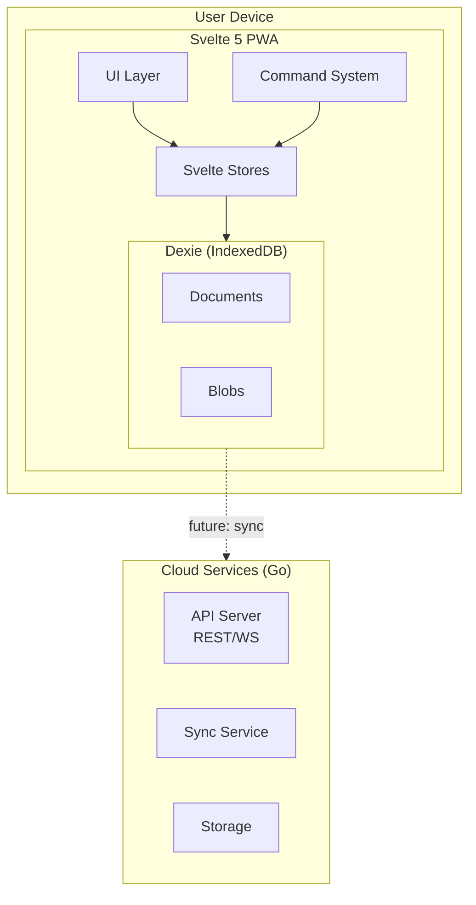

# RFC 0002: Project Architecture

- **Status**: Accepted
- **Authors**: Kaustav Das Modak, Claude
- **Created**: 2025-02-05
- **Depends on**: [RFC 0001: POC Scope](./0001-poc-scope.md)

## Summary

Prolly is a learning tool built as a local-first PWA with an optional cloud backend. This RFC defines the high-level architecture and guiding principles.

## Motivation

Learners and educators need tools that work reliably regardless of connectivity. By building local-first, we ensure the core experience is always available. Cloud features enhance but don't gate the experience.

## Architecture Overview



## Frontend: Svelte 5 PWA

### Technology Choices

- **Svelte 5**: Runes for reactivity, compiled output, small bundle size
- **SvelteKit**: File-based routing, SSR capability (though we'll primarily use SPA mode)
- **Dexie**: IndexedDB wrapper for local storage
- **Service Worker**: Offline capability via Vite PWA plugin or custom

### Principles

1. **Offline-first**: All features work without network
2. **Local data ownership**: User data lives on their device by default
3. **Progressive enhancement**: Cloud features layer on top

### Storage Strategy

- **Dexie tables**: Structured data (entities, relations)
- **Dexie blobs**: Rich media (images, files, attachments)
- **Separate local-only store**: Device settings, UI preferences

## Backend: Go Modular Monolith

### Technology Choices

- **Go 1.25+**: Single binary deployment, strong stdlib
- **Modular monolith**: Services as internal packages, can split later if needed

### Service Modules

| Module | Responsibility |
|--------|----------------|
| `api` | REST endpoints, WebSocket connections |
| `sync` | Client-server sync protocol |
| `storage` | Cloud persistence, file storage |
| `auth` | Authentication, sessions |
| `public` | Public profiles, shared projects |

### Design Principles

1. **Intentionally simple**: Avoid premature abstraction
2. **Single binary**: All modules compile to one executable
3. **Run modes**: Can run all services or specific modules via flags

```bash
# Run everything
prolly serve

# Run only API server
prolly serve --modules=api

# Run sync service standalone
prolly serve --modules=sync
```

## Sync Architecture (Future)

### Approach

Custom sync service over CRDTs (not PouchDB). Options being considered:

1. **Event-based sync**: Client sends activity events, server reconciles
2. **WebSocket**: Real-time bidirectional sync
3. **WebRTC DataChannel**: Peer-to-peer option via Pion

### Sync Flow


### Conflict Resolution by Entity Type

| Entity Type | Strategy | Rationale |
|-------------|----------|-----------|
| User settings | Last-write-wins | Low conflict frequency, user controls their own settings |
| Space, Curriculum, Lesson, Project | Last-write-wins with timestamp | Structure changes are infrequent |
| Objective prerequisites | Server-authoritative | DAG integrity must be maintained |
| Activity | Append-only, no conflicts | Immutable event log |
| Observation, Note, Reflection | Last-write-wins | Single author per entry |
| Feedback | Last-write-wins | Single author per entry |
| Progress | Server-authoritative | Prevents gaming/inconsistency |
| Note/Lesson content (future) | CRDTs | Collaborative text editing |

For POC (single-user), conflict resolution is not applicable. This table guides future multi-device and multi-user implementation.

## Monorepo Structure

```
prolly/
├── app/                      # Svelte 5 PWA
│   ├── src/
│   │   ├── lib/
│   │   │   ├── db/           # Dexie setup
│   │   │   ├── models/       # TypeScript types
│   │   │   ├── stores/       # Svelte stores
│   │   │   ├── components/   # UI components
│   │   │   ├── actions/      # Svelte actions
│   │   │   └── commands/     # Command system
│   │   └── routes/           # SvelteKit pages
│   ├── static/
│   └── package.json
│
├── services/                 # Go backend
│   ├── cmd/prolly/           # Main entry point
│   ├── internal/
│   │   ├── models/           # Domain models
│   │   ├── api/              # HTTP handlers
│   │   ├── sync/             # Sync logic
│   │   └── storage/          # Persistence
│   └── go.mod
│
├── rfc/                      # Design documents
└── docs/                     # Additional docs
```

## Data Contract

Frontend (TypeScript) and backend (Go) must maintain schema alignment. Strategy:

### Approach

1. **Source of truth**: TypeScript interfaces in `app/src/lib/models/`
2. **Go generation**: Use [tygo](https://github.com/gzuidhof/tygo) or manual mirroring with struct tags
3. **Validation**: JSON Schema generated from TypeScript for runtime validation on both ends
4. **Contract testing**: API integration tests verify request/response shapes match

### Schema Sync Process


### Guidelines

- All entity changes start in TypeScript interfaces
- Go structs must use `json` tags matching TypeScript field names (camelCase)
- Breaking changes require version bump and migration path
- CI runs contract tests on every PR touching models

## Security Considerations

### POC (Local-First)

- **No encryption at rest**: IndexedDB does not encrypt by default. This is acceptable for POC as data is local-only.
- **No authentication**: Single-user, local-only mode requires no auth.

### Cloud Features (Future)

| Concern | Approach |
|---------|----------|
| Authentication | OAuth2/OIDC via Auth0, Clerk, or Supabase Auth |
| Authorization | RBAC/ReBAC based on Space membership roles |
| Data at rest | AES-256-GCM encryption in cloud storage |
| Data in transit | TLS 1.3 required for all API connections |
| Sensitive fields | Client-side encryption via Web Crypto API before sync (reflections, observations) |
| Sessions | JWT with short expiry + refresh tokens |

### Privacy

- No tracking or analytics by default
- Telemetry is opt-in only
- User data never shared with third parties
- Users can export and delete all their data

## Development Setup

### Prerequisites

- Node.js 24+ (LTS)
- pnpm 9+
- Go 1.25+

### Frontend Only (POC)

```bash
cd app
pnpm install
pnpm dev          # Start dev server at http://localhost:5173
pnpm build        # Production build
pnpm preview      # Preview production build
```

### Full Stack (Future)

```bash
# Terminal 1: Frontend
cd app
pnpm dev

# Terminal 2: Backend
cd services
go run ./cmd/prolly serve

# Or use the provided dev script (future)
./scripts/dev.sh  # Runs both with hot reload
```

### Environment Variables

```bash
# app/.env.local (frontend)
PUBLIC_API_URL=http://localhost:8080  # Only needed when backend exists

# services/.env (backend, future)
DATABASE_URL=postgres://...
JWT_SECRET=...
```

## Alternatives & Tradeoffs

### Frontend Framework

| Option | Pros | Cons |
|--------|------|------|
| **Svelte 5** (chosen) | Compiled (small bundles), runes are intuitive, less boilerplate | Smaller ecosystem, fewer devs familiar |
| React | Large ecosystem, many devs know it, extensive tooling | Runtime overhead, more boilerplate, larger bundles |
| Vue 3 | Good balance, Composition API | Smaller ecosystem than React, two API styles |
| SolidJS | Fine-grained reactivity, small bundles | Smallest ecosystem, JSX required |

**Rationale**: PWA bundle size matters for offline caching. Svelte 5's compiled output and runes provide excellent DX with minimal runtime overhead.

### Backend Language

| Option | Pros | Cons |
|--------|------|------|
| **Go** (chosen) | Single binary, strong stdlib, excellent concurrency, fast compilation | Verbose error handling, no generics until recently |
| Rust | Maximum performance, memory safety | Steep learning curve, slower compilation |
| Node.js/TypeScript | Shared language with frontend, large ecosystem | Runtime overhead, dependency management |
| Elixir | Excellent concurrency, fault tolerance | Smaller ecosystem, different paradigm |

**Rationale**: Go's single binary deployment, strong standard library, and built-in concurrency make it ideal for a modular monolith that may later split.

### Backend Architecture

| Option | Pros | Cons |
|--------|------|------|
| **Modular monolith** (chosen) | Simple deployment, easy refactoring, shared memory | Must be careful about module boundaries |
| Microservices | Independent scaling, technology flexibility | Operational complexity, network overhead |
| Serverless | No server management, auto-scaling | Cold starts, vendor lock-in, state management |

**Rationale**: Start simple. Modular monolith with clear boundaries can be split later if needed.

### Sync Transport

| Option | Pros | Cons |
|--------|------|------|
| **WebSocket** (likely) | Bidirectional, widely supported, simple | Requires persistent connection |
| WebRTC DataChannel | P2P possible, lower latency | Complex NAT traversal, browser-only |
| Server-Sent Events + HTTP | Simple, works through proxies | Unidirectional, separate upload path |
| HTTP polling | Simplest, works everywhere | Latency, server load |

**Rationale**: WebSocket is the likely choice for balance of simplicity and capability. WebRTC DataChannel remains an option for P2P scenarios.

### Deployment Model

| Option | Pros | Cons |
|--------|------|------|
| **Separate frontend/backend** | Independent scaling, CDN for frontend | Two deployments to manage |
| Backend serves frontend | Single deployment, simpler CORS | Couples deployments, less CDN flexibility |
| Edge functions | Low latency, global | Limited runtime, vendor-specific |

**Rationale**: Decision deferred. For POC, frontend is purely static (PWA). Production deployment can be decided based on needs.

## Open Questions

1. Should the Go backend serve the frontend, or deploy separately?
2. WebRTC DataChannel for sync—worth the complexity?
3. Schema versioning strategy for Dexie migrations?

## References

- [Local-First Software](https://www.inkandswitch.com/local-first/)
- [Svelte 5 Runes](https://svelte.dev/blog/runes)
- [Dexie.js](https://dexie.org/)
