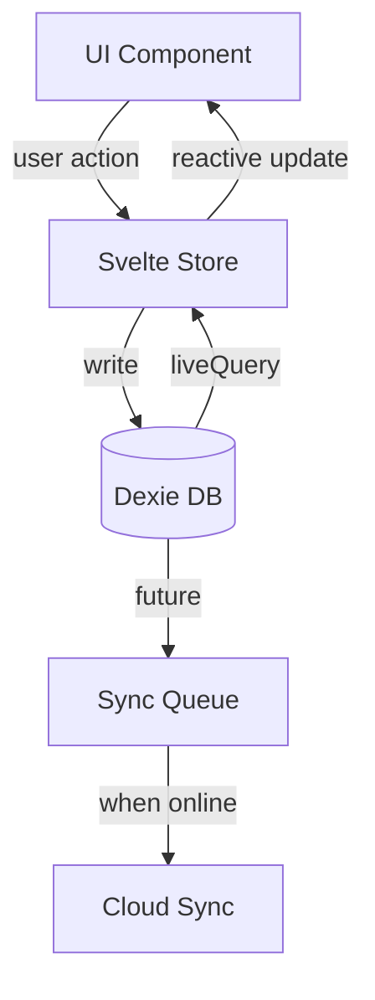

# RFC 0004: Local-First Storage

- **Status**: Accepted
- **Authors**: Kaustav Das Modak, Claude
- **Created**: 2025-02-05
- **Depends on**: [RFC 0001: POC Scope](./0001-poc-scope.md), [RFC 0003: Data Model](./0003-data-model.md)

## Summary

Defines the local storage architecture using Dexie (IndexedDB) for the Prolly PWA. Covers schema design, blob storage, migrations, and offline capabilities.

## Motivation

Local-first means the app works fully offline with all user data on-device. This provides:
- Instant response times (no network latency)
- Privacy by default (data stays local until explicitly synced)
- Reliability (works regardless of connectivity)

## Technology Choice: Dexie

[Dexie.js](https://dexie.org/) is chosen over alternatives because:
- Clean Promise-based API over IndexedDB
- Excellent TypeScript support
- Built-in migration system
- Good performance with large datasets
- Active maintenance and community

Not using PouchDB because:
- CouchDB sync model doesn't match our custom sync approach
- More opinionated about data structure
- Heavier bundle size

## Database Structure

### Multiple Databases

```typescript
// Main data store
const db = new Dexie('prolly');

// Device-local settings (never synced)
const localDb = new Dexie('prolly-local');
```

Separation ensures:
- Clear boundary between syncable and local-only data
- Settings persist even if main data is cleared
- Simpler sync logic

### Main Database Schema

```typescript
import Dexie, { Table } from 'dexie';

interface ProllyDB extends Dexie {
  users: Table<User>;
  spaces: Table<Space>;
  memberships: Table<Membership>;
  curricula: Table<Curriculum>;
  objectives: Table<Objective>;
  lessons: Table<Lesson>;
  projects: Table<Project>;
  resources: Table<Resource>;
  activities: Table<Activity>;
  observations: Table<Observation>;
  notes: Table<Note>;
  feedback: Table<Feedback>;
  reflections: Table<Reflection>;
  reflectionTemplates: Table<ReflectionTemplate>;
  progress: Table<Progress>;
  blobs: Table<StoredBlob>;       // Named StoredBlob to avoid conflict with native Blob
}

const db = new Dexie('prolly') as ProllyDB;

db.version(1).stores({
  users: 'id, email',
  spaces: 'id, ownerId, type',
  memberships: 'id, userId, spaceId, [userId+spaceId]',
  curricula: 'id, spaceId, [spaceId+createdAt]',
  objectives: 'id, curriculumId, [curriculumId+order]',
  lessons: 'id, spaceId, [spaceId+createdAt], *objectiveIds',
  projects: 'id, spaceId, status, [spaceId+createdAt]',
  resources: 'id, spaceId, type, [spaceId+createdAt]',
  activities: 'id, userId, spaceId, type, [userId+createdAt], [spaceId+createdAt], [spaceId+type]',
  observations: 'id, authorId, subjectId, spaceId, [spaceId+createdAt]',
  notes: 'id, authorId, spaceId, [spaceId+createdAt], *tags',
  feedback: 'id, authorId, recipientId, spaceId, [spaceId+createdAt]',
  reflections: 'id, authorId, spaceId, [spaceId+createdAt]',
  reflectionTemplates: 'id, spaceId',
  progress: 'id, userId, objectiveId, [userId+objectiveId], status',
  blobs: 'id, checksum'
});
```

### Local Database Schema

```typescript
interface LocalDB extends Dexie {
  settings: Table<LocalSettings>;
  uiState: Table<UIState>;
  syncQueue: Table<SyncQueueItem>;  // For future sync
}

const localDb = new Dexie('prolly-local') as LocalDB;

localDb.version(1).stores({
  settings: 'key',
  uiState: 'key',
  syncQueue: '++id, entityType, entityId, operation, createdAt'
});
```

## Blob Storage

Rich media (images, files) stored as blobs in IndexedDB.

### Storage Strategy

```typescript
// Named StoredBlob to avoid conflict with native Blob type
interface StoredBlob {
  id: string;           // UUIDv7
  data: ArrayBuffer;    // Raw bytes
  mimeType: string;
  size: number;
  checksum: string;     // SHA-256 for integrity/dedup
  refCount: number;     // Reference count for cleanup
  createdAt: string;
}

// Compute checksum using Web Crypto API
async function computeChecksum(buffer: ArrayBuffer): Promise<string> {
  const hashBuffer = await crypto.subtle.digest('SHA-256', buffer);
  const hashArray = Array.from(new Uint8Array(hashBuffer));
  return hashArray.map(b => b.toString(16).padStart(2, '0')).join('');
}

// Store blob with deduplication
async function storeBlob(file: File): Promise<string> {
  const buffer = await file.arrayBuffer();
  const checksum = await computeChecksum(buffer);

  // Check for duplicate - increment refCount if exists
  const existing = await db.blobs.where('checksum').equals(checksum).first();
  if (existing) {
    await db.blobs.update(existing.id, { refCount: existing.refCount + 1 });
    return existing.id;
  }

  const id = generateUUIDv7();
  await db.blobs.add({
    id,
    data: buffer,
    mimeType: file.type,
    size: buffer.byteLength,
    checksum,
    refCount: 1,
    createdAt: new Date().toISOString()
  });

  return id;
}

// Retrieve blob as object URL
// IMPORTANT: Caller must call URL.revokeObjectURL() when done to prevent memory leaks
async function getBlobUrl(id: string): Promise<string | null> {
  const storedBlob = await db.blobs.get(id);
  if (!storedBlob) return null;

  const nativeBlob = new Blob([storedBlob.data], { type: storedBlob.mimeType });
  return URL.createObjectURL(nativeBlob);
}

// Release blob reference - deletes if refCount reaches 0
async function releaseBlob(id: string): Promise<void> {
  const blob = await db.blobs.get(id);
  if (!blob) return;

  if (blob.refCount <= 1) {
    await db.blobs.delete(id);
  } else {
    await db.blobs.update(id, { refCount: blob.refCount - 1 });
  }
}

// Cleanup orphaned blobs (refCount = 0, older than 24 hours)
async function cleanupOrphanedBlobs(): Promise<number> {
  const cutoff = new Date(Date.now() - 24 * 60 * 60 * 1000).toISOString();
  const orphans = await db.blobs
    .where('refCount').equals(0)
    .and(blob => blob.createdAt < cutoff)
    .toArray();

  await db.blobs.bulkDelete(orphans.map(b => b.id));
  return orphans.length;
}
```

### Size Considerations

IndexedDB has no hard limit, but practical limits exist:
- Chrome: ~80% of available disk space
- Firefox: ~50% of available disk space
- Safari: More restrictive, prompts user after ~1GB

Mitigation strategies:
- Track total storage used
- Warn user when approaching limits
- Offer cleanup of unused blobs
- Future: offload old blobs to cloud

## Migrations

Dexie handles schema migrations via version increments.

```typescript
// Initial schema
db.version(1).stores({
  users: 'id, email',
  // ...
});

// Adding a new table
db.version(2).stores({
  users: 'id, email',
  newTable: 'id, someIndex',
  // ...
});

// Adding an index to existing table
db.version(3).stores({
  users: 'id, email, newField',
  // ...
});

// Data migration
db.version(4).stores({
  // ... same schema
}).upgrade(tx => {
  return tx.table('users').toCollection().modify(user => {
    user.newField = computeDefault(user);
  });
});
```

### Migration Principles

1. **Never delete data implicitly**: Explicit cleanup only
2. **Additive changes preferred**: New fields, new tables
3. **Test migrations thoroughly**: Hard to rollback
4. **Version in code, not config**: Schema lives with app

## Querying Patterns

### Common Queries

```typescript
// Get all spaces for a user
async function getUserSpaces(userId: string): Promise<Space[]> {
  const memberships = await db.memberships.where('userId').equals(userId).toArray();
  const spaceIds = memberships.map(m => m.spaceId);
  return db.spaces.where('id').anyOf(spaceIds).toArray();
}

// Get curriculum with objectives
async function getCurriculumWithObjectives(curriculumId: string) {
  const [curriculum, objectives] = await Promise.all([
    db.curricula.get(curriculumId),
    db.objectives.where('curriculumId').equals(curriculumId).toArray()
  ]);
  return { curriculum, objectives };
}

// Get recent activities for a space
async function getRecentActivities(spaceId: string, limit = 50): Promise<Activity[]> {
  return db.activities
    .where('[spaceId+createdAt]')
    .between([spaceId, Dexie.minKey], [spaceId, Dexie.maxKey])
    .reverse()
    .limit(limit)
    .toArray();
}
```

### Reactive Queries with Svelte

Using Dexie's `liveQuery` with Svelte 5 runes:

```typescript
import { liveQuery } from 'dexie';

// In a .svelte file with runes
let spaces = $state<Space[]>([]);

$effect(() => {
  const subscription = liveQuery(() => getUserSpaces(currentUserId)).subscribe({
    next: value => spaces = value,
    error: err => console.error(err)
  });

  return () => subscription.unsubscribe();
});
```

## Offline Capabilities

### Service Worker

Using Vite PWA plugin or Workbox for:
- Caching app shell
- Caching static assets
- Background sync queue (future)

```typescript
// vite.config.ts
import { VitePWA } from 'vite-plugin-pwa';

export default defineConfig({
  plugins: [
    VitePWA({
      registerType: 'autoUpdate',
      workbox: {
        globPatterns: ['**/*.{js,css,html,ico,png,svg,woff2}']
      },
      manifest: {
        name: 'Prolly',
        short_name: 'Prolly',
        theme_color: '#ffffff',
        icons: [/* ... */]
      }
    })
  ]
});
```

### Sync Queue (Future)

For when cloud sync is implemented:

```typescript
interface SyncQueueItem {
  id?: number;          // Auto-increment
  entityType: string;
  entityId: string;
  operation: 'create' | 'update' | 'delete';
  payload: unknown;
  createdAt: string;
  attempts: number;
  lastError?: string;
}

// Queue changes for sync
async function queueForSync(
  entityType: string,
  entityId: string,
  operation: 'create' | 'update' | 'delete',
  payload: unknown
) {
  await localDb.syncQueue.add({
    entityType,
    entityId,
    operation,
    payload,
    createdAt: new Date().toISOString(),
    attempts: 0
  });
}
```

## Data Flow



## Performance Considerations

1. **Batch operations**: Use `bulkAdd`, `bulkPut` for multiple items
2. **Pagination**: Always limit queries, implement cursor-based pagination
3. **Selective loading**: Don't load full entities when only IDs needed
4. **Index usage**: Ensure queries use defined indexes

## Error Handling

### Error Types

| Error | Cause | Recovery |
|-------|-------|----------|
| `QuotaExceededError` | Storage limit reached | Show warning, offer cleanup, prevent write |
| `ConstraintError` | Duplicate key or index violation | Log and surface to user, rollback transaction |
| `NotFoundError` | Database or table doesn't exist | Re-initialize database |
| `AbortError` | Transaction aborted | Retry with exponential backoff (max 3 attempts) |
| `VersionError` | Schema version mismatch | Force reload, run migrations |

### Error Handling Pattern

```typescript
import { Dexie } from 'dexie';

async function safeDbOperation<T>(
  operation: () => Promise<T>,
  context: string
): Promise<T> {
  try {
    return await operation();
  } catch (error) {
    if (error instanceof Dexie.QuotaExceededError) {
      // Notify user, offer cleanup
      notifyStorageFull();
      throw new AppError('STORAGE_FULL', 'Device storage is full. Please free up space.');
    }
    if (error instanceof Dexie.ConstraintError) {
      console.error(`Constraint violation in ${context}:`, error);
      throw new AppError('CONSTRAINT_ERROR', 'Data conflict detected.');
    }
    if (error instanceof Dexie.AbortError) {
      console.warn(`Transaction aborted in ${context}, may retry`);
      throw error; // Let caller decide on retry
    }
    // Unknown error
    console.error(`Database error in ${context}:`, error);
    throw new AppError('DB_ERROR', 'An unexpected error occurred.');
  }
}
```

## Transaction Boundaries

Operations that must be atomic:

| Operation | Tables Involved | Transaction Scope |
|-----------|-----------------|-------------------|
| Create curriculum with objectives | `curricula`, `objectives` | Single transaction |
| Delete curriculum | `curricula`, `objectives`, `lessons` | Single transaction |
| Update objective prerequisites | `objectives` (multiple) | Single transaction with DAG validation |
| Create resource with blob | `resources`, `blobs` | Single transaction |
| Delete resource | `resources`, `blobs` (refCount update) | Single transaction |
| Record activity with progress update | `activities`, `progress` | Single transaction |

### Transaction Example

```typescript
// Create curriculum with initial objectives (atomic)
async function createCurriculumWithObjectives(
  curriculum: Omit<Curriculum, 'id' | 'createdAt' | 'updatedAt'>,
  objectives: Omit<Objective, 'id' | 'createdAt' | 'updatedAt' | 'curriculumId'>[]
): Promise<{ curriculum: Curriculum; objectives: Objective[] }> {
  return db.transaction('rw', [db.curricula, db.objectives], async () => {
    const now = new Date().toISOString();
    const curriculumId = generateUUIDv7();

    const newCurriculum: Curriculum = {
      ...curriculum,
      id: curriculumId,
      createdAt: now,
      updatedAt: now,
      version: 1,
    };

    const newObjectives: Objective[] = objectives.map(obj => ({
      ...obj,
      id: generateUUIDv7(),
      curriculumId,
      createdAt: now,
      updatedAt: now,
      version: 1,
    }));

    await db.curricula.add(newCurriculum);
    await db.objectives.bulkAdd(newObjectives);

    return { curriculum: newCurriculum, objectives: newObjectives };
  });
}
```

## Backup & Export

Users must be able to export their data for backup and portability.

### Export Format

```typescript
interface ProllyExport {
  version: string;           // Export format version
  exportedAt: string;        // ISO 8601
  data: {
    users: User[];
    spaces: Space[];
    memberships: Membership[];
    curricula: Curriculum[];
    objectives: Objective[];
    lessons: Lesson[];
    projects: Project[];
    resources: Resource[];
    activities: Activity[];
    observations: Observation[];
    notes: Note[];
    feedback: Feedback[];
    reflections: Reflection[];
    reflectionTemplates: ReflectionTemplate[];
    progress: Progress[];
  };
  blobs: {
    id: string;
    mimeType: string;
    data: string;            // Base64 encoded
  }[];
}

// Export all data
async function exportAllData(): Promise<ProllyExport> {
  const [users, spaces, memberships, curricula, objectives, lessons,
         projects, resources, activities, observations, notes,
         feedback, reflections, reflectionTemplates, progress, blobs] =
    await Promise.all([
      db.users.toArray(),
      db.spaces.toArray(),
      db.memberships.toArray(),
      db.curricula.toArray(),
      db.objectives.toArray(),
      db.lessons.toArray(),
      db.projects.toArray(),
      db.resources.toArray(),
      db.activities.toArray(),
      db.observations.toArray(),
      db.notes.toArray(),
      db.feedback.toArray(),
      db.reflections.toArray(),
      db.reflectionTemplates.toArray(),
      db.progress.toArray(),
      db.blobs.toArray(),
    ]);

  return {
    version: '1.0',
    exportedAt: new Date().toISOString(),
    data: { users, spaces, memberships, curricula, objectives, lessons,
            projects, resources, activities, observations, notes,
            feedback, reflections, reflectionTemplates, progress },
    blobs: blobs.map(b => ({
      id: b.id,
      mimeType: b.mimeType,
      data: arrayBufferToBase64(b.data),
    })),
  };
}

// Import data (merges with existing, uses newer version on conflict)
async function importData(exported: ProllyExport): Promise<void> {
  // Implementation handles version conflicts using `version` field
  // Skips entities where local version >= imported version
}
```

### Export Triggers

- Manual: User clicks "Export Data" in settings
- Automatic: Before destructive operations (clear data, sign out)
- Scheduled: Optional periodic backup to file system (if File System Access API available)

## Security

- IndexedDB is origin-bound (same-origin policy)
- Data persists until explicitly cleared or storage pressure
- No encryption at rest by default (browser limitation)
- Future: Consider Web Crypto API for sensitive fields

## Testing

```typescript
// Use fake-indexeddb for testing
import 'fake-indexeddb/auto';
import { db } from './db';

beforeEach(async () => {
  await db.delete();
  await db.open();
});

test('creates user', async () => {
  const user = { id: 'test-id', name: 'Test', /* ... */ };
  await db.users.add(user);
  const retrieved = await db.users.get('test-id');
  expect(retrieved).toEqual(user);
});
```

## Alternatives & Tradeoffs

### Dexie vs Other Options

| Option | Pros | Cons |
|--------|------|------|
| **Dexie** (chosen) | Clean API, TypeScript, migrations, performant, active community | Additional dependency |
| PouchDB | Built-in CouchDB sync, mature | Opinionated sync model we don't want, heavier bundle |
| Raw IndexedDB | No dependencies, full control | Verbose, callback-heavy, no migration system |
| localForage | Simple key-value API | No indexing, not suitable for relational queries |
| OPFS (Origin Private File System) | True file system access, good for large files | Limited browser support, lower-level API |

### Single Database vs Multiple

**Chosen**: Two databases (main + local-only)

| Approach | Pros | Cons |
|----------|------|------|
| Single database | Simpler mental model | Sync logic must filter local-only data |
| Multiple databases (chosen) | Clear sync boundary, local data survives main data reset | Two connections to manage |

### Blob Storage Strategy

| Approach | Pros | Cons |
|----------|------|------|
| IndexedDB blobs (chosen) | Same transaction guarantees, simple | Storage quotas, no streaming |
| OPFS | Better for large files, streaming | Limited support, separate API |
| Base64 in records | Simplest | 33% size overhead, slow |

**Rationale**: IndexedDB blobs are sufficient for POC. Can migrate to OPFS for large media later.

## Open Questions

1. Should we implement soft deletes for sync support?
2. How to handle storage quota exceeded gracefully?
3. Encryption strategy for sensitive data?

## References

- [Dexie.js Documentation](https://dexie.org/docs/)
- [IndexedDB API](https://developer.mozilla.org/en-US/docs/Web/API/IndexedDB_API)
- [Workbox](https://developer.chrome.com/docs/workbox/)
