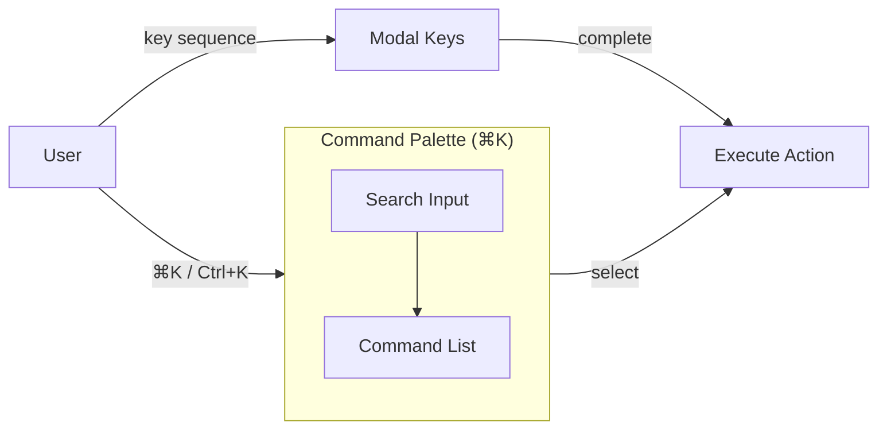
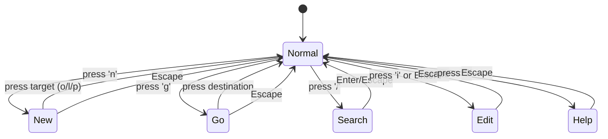
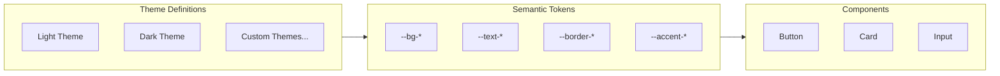
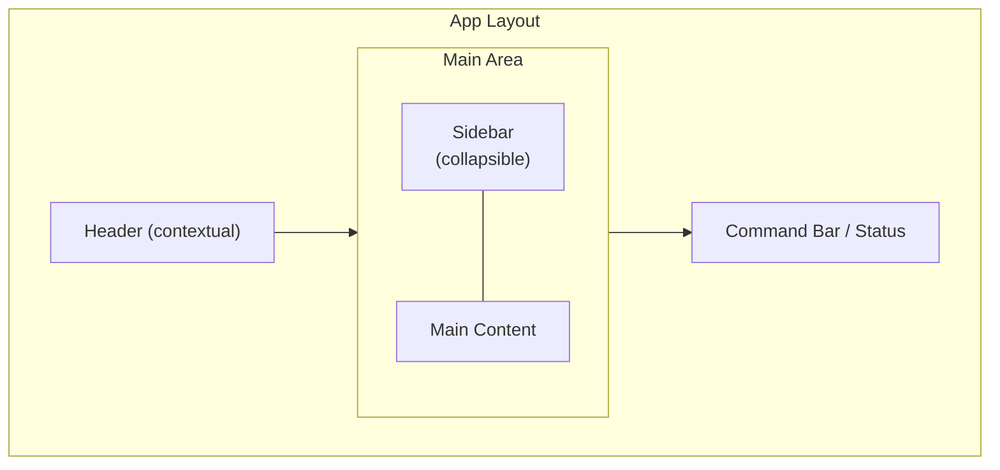

# RFC 0005: UI/UX Design System

- **Status**: Accepted
- **Authors**: Kaustav Das Modak, Claude
- **Created**: 2025-02-05
- **Depends on**: [RFC 0001: POC Scope](./0001-poc-scope.md)

## Summary

Defines the design principles, interaction patterns, and component architecture for Prolly's user interface. Emphasizes keyboard-first interaction, combinatorial commands, and minimalist aesthetics.

## Design Principles

### 1. Keyboard-First

Every action reachable via keyboard. Mouse/touch supported but not required.

### 2. Combinatorial Interfaces

Commands compose like vim: modifiers + actions = behavior. Build complex operations from simple, memorable primitives.

### 3. Minimalist Chrome

Content takes center stage. UI elements appear contextually, not persistently. Reduce visual noise.

### 4. Progressive Disclosure

Start simple, reveal depth on demand. Don't overwhelm new users; don't constrain power users.

### 5. Pixel-Perfect

Precise spacing, alignment, typography. Consistent visual rhythm across all screen sizes.

### 6. Get Out of the Way

The tool serves learning, not itself. Invisible when working, helpful when needed.

## Interaction Model

### Command System

Central to the UX: a command palette and modal key system.



### Key Binding Philosophy

Inspired by vim, adapted for learning context:

| Prefix | Meaning | Examples |
|--------|---------|----------|
| `n` | New / Create | `n o` (new objective), `n l` (new lesson) |
| `g` | Go / Navigate | `g o` (go to objectives), `g h` (go home) |
| `e` | Edit | `e e` (edit current), `e n` (edit name) |
| `d` | Delete | `d d` (delete current) |
| `m` | Mark / Toggle | `m c` (mark complete), `m s` (mark started) |
| `v` | View / Show | `v a` (view activities), `v p` (view progress) |
| `/` | Search | `/` (open search) |
| `?` | Help | `?` (show shortcuts) |

### Modal States



### Escape Hatch

`Escape` always returns to normal mode. Never trap the user.

### Discoverability

- `?` shows all available commands for current context
- Command palette shows keyboard shortcuts inline
- First-run tutorial introduces key concepts

## Visual Design

### Typography

```css
:root {
  --font-sans: 'Inter', -apple-system, BlinkMacSystemFont, sans-serif;
  --font-mono: 'JetBrains Mono', 'Fira Code', monospace;

  --text-xs: 0.75rem;    /* 12px */
  --text-sm: 0.875rem;   /* 14px */
  --text-base: 1rem;     /* 16px */
  --text-lg: 1.125rem;   /* 18px */
  --text-xl: 1.25rem;    /* 20px */
  --text-2xl: 1.5rem;    /* 24px */
}
```

### Spacing Scale

```css
:root {
  --space-1: 0.25rem;    /* 4px */
  --space-2: 0.5rem;     /* 8px */
  --space-3: 0.75rem;    /* 12px */
  --space-4: 1rem;       /* 16px */
  --space-6: 1.5rem;     /* 24px */
  --space-8: 2rem;       /* 32px */
  --space-12: 3rem;      /* 48px */
  --space-16: 4rem;      /* 64px */
}
```

### Theming System

The design system supports multiple themes with a semantic token architecture. Themes define color values; components consume semantic tokens.

#### Architecture



#### Theme Structure

```typescript
interface Theme {
  id: string;
  name: string;
  isDark: boolean;
  colors: {
    // Surfaces
    bgPrimary: string;
    bgSecondary: string;
    bgTertiary: string;

    // Text
    textPrimary: string;
    textSecondary: string;
    textTertiary: string;

    // Borders
    borderDefault: string;
    borderStrong: string;

    // Accents
    accentPrimary: string;
    accentSuccess: string;
    accentWarning: string;
    accentError: string;
  };
}
```

#### Default Light Theme

```css
[data-theme="light"] {
  /* Surfaces */
  --bg-primary: #ffffff;
  --bg-secondary: #f9fafb;
  --bg-tertiary: #f3f4f6;

  /* Text */
  --text-primary: #111827;
  --text-secondary: #6b7280;
  --text-tertiary: #9ca3af;

  /* Borders */
  --border-default: #e5e7eb;
  --border-strong: #d1d5db;

  /* Accents */
  --accent-primary: #2563eb;
  --accent-success: #059669;
  --accent-warning: #d97706;
  --accent-error: #dc2626;

  /* Focus */
  --focus-ring: 0 0 0 2px var(--accent-primary);
}
```

#### Default Dark Theme

```css
[data-theme="dark"] {
  /* Surfaces */
  --bg-primary: #0f0f0f;
  --bg-secondary: #171717;
  --bg-tertiary: #262626;

  /* Text */
  --text-primary: #fafafa;
  --text-secondary: #a3a3a3;
  --text-tertiary: #737373;

  /* Borders */
  --border-default: #262626;
  --border-strong: #404040;

  /* Accents */
  --accent-primary: #3b82f6;
  --accent-success: #10b981;
  --accent-warning: #f59e0b;
  --accent-error: #ef4444;

  /* Focus */
  --focus-ring: 0 0 0 2px var(--accent-primary);
}
```

#### Theme Selection

```typescript
type ThemePreference = 'light' | 'dark' | 'system';

function applyTheme(preference: ThemePreference) {
  let theme: 'light' | 'dark';

  if (preference === 'system') {
    theme = window.matchMedia('(prefers-color-scheme: dark)').matches
      ? 'dark'
      : 'light';
  } else {
    theme = preference;
  }

  document.documentElement.setAttribute('data-theme', theme);
}

// Listen for system preference changes
window.matchMedia('(prefers-color-scheme: dark)')
  .addEventListener('change', (e) => {
    if (currentPreference === 'system') {
      applyTheme('system');
    }
  });
```

#### Future: Custom Themes

The architecture supports custom themes by:
1. Defining a new theme object with required color tokens
2. Generating CSS custom properties from the theme
3. Storing user theme preferences in local settings

Custom themes are out of scope for POC but the token-based architecture enables them
```

### Layout



- Sidebar collapses on mobile
- Command bar appears on keyboard activation
- Header minimal or hidden when not needed

## Component Architecture

### Primitive Components

```
Button
├── variant: primary | secondary | ghost | danger
├── size: sm | md | lg
└── disabled, loading states

Input
├── type: text | search | textarea
├── size: sm | md | lg
└── error state, help text

Card
├── variant: default | interactive | selected
└── padding options

Badge
├── variant: default | success | warning | error
└── size: sm | md

Modal
├── size: sm | md | lg | full
└── closeable, escapeable

Dropdown
├── trigger
├── items
└── keyboard navigation
```

### Compound Components

```
CommandPalette
├── SearchInput
├── CommandList
│   └── CommandItem (icon, label, shortcut)
└── keyboard navigation + fuzzy search

ObjectiveCard
├── Status indicator
├── Title
├── Progress
└── Actions (contextual)

ActivityFeed
├── ActivityItem
│   ├── Icon
│   ├── Description
│   └── Timestamp
└── Load more / virtualization

NavigationTree
├── TreeNode (recursive)
│   ├── Expand/collapse
│   ├── Label
│   └── Children
└── keyboard navigation
```

### Component Build Order by Milestone

Components should be built in order of milestone dependency:

| Milestone | Components | Rationale |
|-----------|------------|-----------|
| **M1: Foundation** | - | No UI components, just project setup |
| **M2: Command System** | Button, Input, Modal, CommandPalette, KeyboardModeIndicator | Core interaction primitives |
| **M3: Core Entities** | Card, Badge, Dropdown, FormField, CurriculumCard, ObjectiveCard, LessonCard, ProjectCard | Entity display and editing |
| **M4: Tracking** | ActivityItem, ActivityFeed, ObservationForm, NoteEditor, ReflectionForm, ProgressIndicator | Tracking and evidence capture |
| **M5: Views & Reports** | NavigationTree, Dashboard widgets, ProgressChart, ReportView | Data visualization and reporting |
| **M6: Polish** | EmptyState, LoadingState, SkeletonScreen, Toast, ErrorBoundary, OnboardingFlow | UX refinements |

**Build primitives first**: Button, Input, Card, Badge must exist before compound components.

## Responsive Behavior

### Breakpoints

```css
--breakpoint-sm: 640px;   /* Mobile landscape */
--breakpoint-md: 768px;   /* Tablet */
--breakpoint-lg: 1024px;  /* Desktop */
--breakpoint-xl: 1280px;  /* Large desktop */
```

### Adaptations

| Element | Mobile | Tablet | Desktop |
|---------|--------|--------|---------|
| Sidebar | Hidden (swipe/button to show) | Collapsible | Persistent |
| Command palette | Full screen | Centered modal | Centered modal |
| Navigation | Bottom bar | Sidebar | Sidebar |
| Lists | Single column | Single column | Multi-column option |

### Touch Considerations

- Minimum touch target: 44x44px
- Swipe gestures for common actions
- Long-press for context menu (mirror right-click)

## Keyboard System Implementation

### Focus Mode Rules

Modal keyboard shortcuts only activate when **no text input is focused**. This prevents conflicts between typing and commands.

```typescript
// Check if keyboard shortcuts should be active
function isCommandModeActive(): boolean {
  const activeElement = document.activeElement;
  if (!activeElement) return true;

  const tagName = activeElement.tagName.toLowerCase();
  const isInput = tagName === 'input' || tagName === 'textarea';
  const isContentEditable = activeElement.getAttribute('contenteditable') === 'true';

  return !isInput && !isContentEditable;
}
```

**Behavior:**
- When focused on input/textarea: All keys type normally, only `Escape` exits to command mode
- When not focused on input: Modal keys are active (`n`, `g`, `d`, etc.)
- `Cmd/Ctrl+K` always opens command palette (even in input)
- `/` focuses search input (passthrough when already in input)

### Key Normalization

```typescript
// utils/keyboard.ts
// Normalize KeyboardEvent to a consistent string representation

export function normalizeKey(event: KeyboardEvent): string {
  const parts: string[] = [];

  // Modifiers (use Cmd on Mac, Ctrl elsewhere)
  if (event.metaKey || event.ctrlKey) {
    parts.push('Mod');  // Normalized: Cmd on Mac, Ctrl on Windows/Linux
  }
  if (event.altKey) {
    parts.push('Alt');
  }
  if (event.shiftKey && event.key.length > 1) {
    // Only add Shift for non-character keys (Shift+A = 'A', Shift+Enter = 'Shift+Enter')
    parts.push('Shift');
  }

  // Key itself
  let key = event.key;

  // Normalize common keys
  const keyMap: Record<string, string> = {
    ' ': 'Space',
    'ArrowUp': 'Up',
    'ArrowDown': 'Down',
    'ArrowLeft': 'Left',
    'ArrowRight': 'Right',
  };
  key = keyMap[key] || key;

  // Single characters are lowercase for consistency
  if (key.length === 1) {
    key = key.toLowerCase();
  }

  parts.push(key);
  return parts.join('+');
}

// Examples:
// 'a' key -> 'a'
// 'A' key (Shift+a) -> 'A' (uppercase preserved)
// Cmd+K on Mac -> 'Mod+k'
// Ctrl+K on Windows -> 'Mod+k'
// Escape -> 'Escape'
// Space -> 'Space'
```

### Global Keyboard Mode State

```typescript
// stores/keyboard.ts
import { writable, derived } from 'svelte/store';

export type KeyboardMode = 'normal' | 'new' | 'go' | 'edit' | 'delete' | 'search';

interface KeyboardState {
  mode: KeyboardMode;
  pending: string[];  // Keys pressed in current sequence
}

function createKeyboardStore() {
  const { subscribe, set, update } = writable<KeyboardState>({
    mode: 'normal',
    pending: [],
  });

  return {
    subscribe,
    setMode: (mode: KeyboardMode) => update(s => ({ ...s, mode, pending: [] })),
    addPending: (key: string) => update(s => ({ ...s, pending: [...s.pending, key] })),
    reset: () => set({ mode: 'normal', pending: [] }),
  };
}

export const keyboardStore = createKeyboardStore();

// Derived store for UI display
export const keyboardModeDisplay = derived(keyboardStore, $kb => {
  if ($kb.mode === 'normal') return null;
  const pendingStr = $kb.pending.length > 0 ? $kb.pending.join(' ') + ' …' : '';
  return { mode: $kb.mode, pending: pendingStr };
});
```

### Svelte Action for Key Bindings

```typescript
// actions/keymap.ts
import { keyboardStore, type KeyboardMode } from '$lib/stores/keyboard';

type KeyHandler = (event: KeyboardEvent) => void | boolean;

interface Keymap {
  [key: string]: KeyHandler | Keymap;
}

export function keymap(node: HTMLElement, keymap: Keymap) {
  let currentMode: Keymap = keymap;
  let modeStack: Keymap[] = [];

  function handleKeydown(event: KeyboardEvent) {
    // Skip if typing in input (except for Escape and Mod+K)
    const key = normalizeKey(event);
    if (!isCommandModeActive() && key !== 'Escape' && !key.startsWith('Mod+')) {
      return;
    }

    const handler = currentMode[key];

    if (typeof handler === 'function') {
      const result = handler(event);
      if (result !== false) {
        event.preventDefault();
      }
      // Reset to root after action
      currentMode = keymap;
      modeStack = [];
      keyboardStore.reset();
    } else if (typeof handler === 'object') {
      // Enter sub-mode
      modeStack.push(currentMode);
      currentMode = handler;
      event.preventDefault();

      // Update global state for UI feedback
      const modeMap: Record<string, KeyboardMode> = {
        'n': 'new', 'g': 'go', 'e': 'edit', 'd': 'delete', '/': 'search'
      };
      if (modeMap[key]) {
        keyboardStore.setMode(modeMap[key]);
      }
      keyboardStore.addPending(key);
    } else if (key === 'Escape') {
      // Reset to root
      currentMode = keymap;
      modeStack = [];
      keyboardStore.reset();
    }
  }

  node.addEventListener('keydown', handleKeydown);

  return {
    destroy() {
      node.removeEventListener('keydown', handleKeydown);
    },
    update(newKeymap: Keymap) {
      keymap = newKeymap;
      currentMode = keymap;
      modeStack = [];
    }
  };
}
```

### Command Registry

```typescript
// commands/registry.ts
interface Command {
  id: string;
  label: string;
  shortcut?: string;
  icon?: string;
  action: () => void | Promise<void>;
  when?: () => boolean;  // Contextual availability
}

interface CommandError {
  commandId: string;
  error: Error;
  timestamp: Date;
}

class CommandRegistry {
  private commands = new Map<string, Command>();
  private errorHandlers: ((error: CommandError) => void)[] = [];

  register(command: Command) {
    this.commands.set(command.id, command);
  }

  unregister(id: string) {
    this.commands.delete(id);
  }

  onError(handler: (error: CommandError) => void) {
    this.errorHandlers.push(handler);
    return () => {
      this.errorHandlers = this.errorHandlers.filter(h => h !== handler);
    };
  }

  async execute(id: string): Promise<void> {
    const command = this.commands.get(id);
    if (!command) {
      console.warn(`Command not found: ${id}`);
      return;
    }

    if (command.when && !command.when()) {
      console.warn(`Command not available: ${id}`);
      return;
    }

    try {
      await command.action();
    } catch (error) {
      const cmdError: CommandError = {
        commandId: id,
        error: error instanceof Error ? error : new Error(String(error)),
        timestamp: new Date(),
      };
      console.error(`Command failed: ${id}`, error);
      this.errorHandlers.forEach(handler => handler(cmdError));
    }
  }

  getAvailable(): Command[] {
    return Array.from(this.commands.values())
      .filter(cmd => !cmd.when || cmd.when());
  }

  search(query: string): Command[] {
    const available = this.getAvailable();
    return fuzzyMatch(available, query, cmd => cmd.label);
  }
}

// Singleton instance
export const commandRegistry = new CommandRegistry();

// Register error handler to show toast
commandRegistry.onError(({ commandId, error }) => {
  showToast({ type: 'error', message: `Action failed: ${error.message}` });
});
```

## Accessibility

### Requirements

- WCAG 2.1 AA compliance minimum
- All interactive elements focusable
- Visible focus indicators
- Screen reader support for dynamic content
- Reduced motion support

### Implementation

```css
/* Respect user preference */
@media (prefers-reduced-motion: reduce) {
  * {
    animation-duration: 0.01ms !important;
    transition-duration: 0.01ms !important;
  }
}

/* Visible focus */
:focus-visible {
  outline: none;
  box-shadow: var(--focus-ring);
}
```

```svelte
<!-- Announce dynamic changes -->
<div aria-live="polite" class="sr-only">
  {announcements}
</div>
```

## Animation Principles

1. **Purposeful**: Animation conveys meaning, not decoration
2. **Fast**: 150-200ms for micro-interactions, 300ms max for transitions
3. **Subtle**: Ease-out for entering, ease-in for exiting
4. **Skippable**: Respect `prefers-reduced-motion`

```css
:root {
  --duration-fast: 150ms;
  --duration-normal: 200ms;
  --duration-slow: 300ms;

  --ease-out: cubic-bezier(0, 0, 0.2, 1);
  --ease-in: cubic-bezier(0.4, 0, 1, 1);
  --ease-in-out: cubic-bezier(0.4, 0, 0.2, 1);
}
```

## Alternatives & Tradeoffs

### Keyboard System

| Approach | Pros | Cons |
|----------|------|------|
| **Vim-like modal** (chosen) | Powerful, composable, memorable | Learning curve, conflicts with text input |
| Single-key shortcuts | Simpler, immediate | Limited namespace, many modifier keys |
| Command palette only | Discoverable, searchable | Slower for power users |
| Emacs-style chords | Powerful | Finger gymnastics, harder to remember |

**Rationale**: Vim-like modals provide composability without requiring modifier keys. The learning curve is acceptable for a power-user-oriented tool.

### Styling Approach

| Approach | Pros | Cons |
|----------|------|------|
| **CSS custom properties** (chosen) | Native, no build step, themeable | Verbose, no nesting |
| Tailwind CSS | Rapid prototyping, consistent | Large class strings, build dependency |
| CSS-in-JS (styled-components) | Scoped, dynamic | Runtime cost, bundle size |
| Sass/SCSS | Powerful, familiar | Build step, less native |

**Rationale**: CSS custom properties are sufficient for our needs, work without build tools, and integrate naturally with theming.

### Component Library

| Approach | Pros | Cons |
|----------|------|------|
| **Custom components** (chosen) | Full control, minimal bundle, matches design | More work upfront |
| Radix + custom styling | Accessible primitives, unstyled | Additional dependency |
| shadcn/ui (Svelte port) | Pre-built, customizable | React-first ecosystem |
| Skeleton UI | Svelte-native, themed | Opinionated styling |

**Rationale**: Build custom components for full control over behavior and styling. May adopt Radix primitives for complex accessibility needs (modals, dropdowns).

### Icon Set

| Option | Pros | Cons |
|--------|------|------|
| Lucide | Consistent, large set, tree-shakeable | Another dependency |
| Heroicons | Clean, two styles (outline/solid) | Smaller set |
| Custom SVGs | Full control, no dependency | Design effort |
| Iconify | Huge selection, unified API | Runtime fetching or large bundle |

**Decision pending**: Evaluate Lucide vs Heroicons based on coverage of needed icons.

### Animation Library

| Approach | Pros | Cons |
|----------|------|------|
| **CSS transitions** (chosen) | Native, performant, simple | Limited orchestration |
| Svelte transitions | Built-in, declarative | Svelte-specific |
| Motion One | Small, performant | Another dependency |
| Framer Motion | Powerful | React-only |

**Rationale**: Start with CSS transitions and Svelte's built-in transitions. Add Motion One only if complex orchestration is needed.

## Open Questions

1. Icon set: Lucide, Heroicons, or custom?
2. Should we support user-customizable key bindings?
3. How to handle keyboard conflicts with browser/OS shortcuts?
4. Rich text editing approach for lesson content?

## References

- [Vim Cheat Sheet](https://vim.rtorr.com/)
- [Linear's Keyboard-First Design](https://linear.app/docs/keyboard-shortcuts)
- [Tailwind CSS](https://tailwindcss.com/)
- [Radix UI Primitives](https://www.radix-ui.com/)
