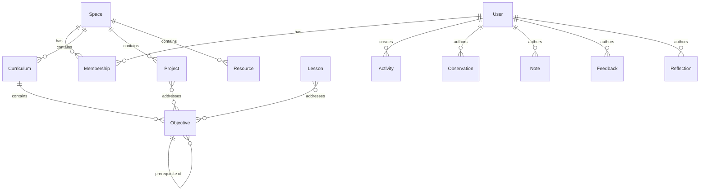

# RFC: Data Model

- **Status**: Draft
- **Authors**: Kaustav Das Modak, Claude
- **Created**: 2025-02-05
- **Depends on**: [RFC 0001: POC Scope](../0001-poc-scope.md)

## Summary

Defines the core entities, their attributes, and relationships for Prolly. This model serves both the frontend (TypeScript/Dexie) and backend (Go) implementations.

## Design Principles

1. **Documents over relations**: Entities are documents with references, not normalized tables
2. **Events as first-class**: Activities form an append-only log
3. **References via ID**: Relations are ID references, resolved at query time
4. **Offline-friendly IDs**: UUIDs generated client-side

## Entity Overview



## Core Entities

### User

The person using the system. Exists locally first, syncs when authenticated.

```typescript
interface User {
  id: string;                    // UUID
  name: string;
  email?: string;                // Only when authenticated
  avatarUrl?: string;
  settings: UserSettings;
  createdAt: string;             // ISO 8601
  updatedAt: string;
}

interface UserSettings {
  theme: 'light' | 'dark' | 'system';
  keyboardLayout: string;        // For command system customization
  // ... extensible
}
```

### Space

Context boundary for organizing work. Every user has an implicit personal space.

```typescript
interface Space {
  id: string;
  name: string;
  description?: string;
  type: 'personal' | 'class' | 'cohort' | 'project' | 'custom';
  ownerId: string;               // User ID
  settings: SpaceSettings;
  createdAt: string;
  updatedAt: string;
}

interface SpaceSettings {
  visibility: 'private' | 'members' | 'public';
  // ... extensible
}
```

### Membership

User's presence in a space with role(s). The RBAC attachment point.

```typescript
interface Membership {
  id: string;
  userId: string;
  spaceId: string;
  roles: Role[];                 // ['learner'], ['educator'], ['learner', 'mentor'], etc.
  joinedAt: string;
  updatedAt: string;
}

type Role = 'learner' | 'educator' | 'mentor' | 'admin';
```

### Curriculum

A structured learning path containing objectives.

```typescript
interface Curriculum {
  id: string;
  spaceId: string;
  name: string;
  description?: string;
  metadata?: Record<string, unknown>;  // External standard alignment, etc.
  createdAt: string;
  updatedAt: string;
}
```

### Objective

A discrete learning goal. Can have prerequisites forming a DAG.

```typescript
interface Objective {
  id: string;
  curriculumId: string;
  name: string;
  description?: string;
  prerequisites: string[];       // Objective IDs (forms DAG)
  metadata?: Record<string, unknown>;
  createdAt: string;
  updatedAt: string;
}
```

### Lesson

A unit of instruction addressing one or more objectives.

```typescript
interface Lesson {
  id: string;
  spaceId: string;
  name: string;
  description?: string;
  content?: string;              // Rich text / markdown
  objectiveIds: string[];        // Objectives this lesson addresses
  resourceIds: string[];         // Attached resources
  order?: number;                // Sequencing within a curriculum
  createdAt: string;
  updatedAt: string;
}
```

### Project

A larger body of work with milestones.

```typescript
interface Project {
  id: string;
  spaceId: string;
  name: string;
  description?: string;
  objectiveIds: string[];        // Objectives this project addresses
  milestones: Milestone[];
  status: 'planning' | 'active' | 'completed' | 'archived';
  createdAt: string;
  updatedAt: string;
}

interface Milestone {
  id: string;
  name: string;
  description?: string;
  dueDate?: string;
  completedAt?: string;
}
```

### Resource

Attachable materials—documents, links, media.

```typescript
interface Resource {
  id: string;
  spaceId: string;
  name: string;
  type: 'link' | 'file' | 'image' | 'video' | 'document';
  url?: string;                  // For links
  blobId?: string;               // For local files (reference to blob storage)
  mimeType?: string;
  metadata?: Record<string, unknown>;
  createdAt: string;
  updatedAt: string;
}
```

## Tracking & Evidence Entities

### Activity

An event in the learning process. The append-only log.

```typescript
interface Activity {
  id: string;
  userId: string;
  spaceId: string;
  type: ActivityType;
  payload: Record<string, unknown>;  // Type-specific data
  refs: ActivityRefs;            // What this activity is about
  createdAt: string;             // Immutable, no updatedAt
}

type ActivityType =
  | 'objective.started'
  | 'objective.achieved'
  | 'lesson.started'
  | 'lesson.completed'
  | 'project.started'
  | 'project.milestone_completed'
  | 'project.completed'
  | 'resource.viewed'
  | 'custom';

interface ActivityRefs {
  objectiveId?: string;
  lessonId?: string;
  projectId?: string;
  resourceId?: string;
  // ... extensible
}
```

### Observation

Notes about progress—self, peer, or learner.

```typescript
interface Observation {
  id: string;
  authorId: string;              // Who wrote it
  subjectId?: string;            // About whom (User ID, if about another)
  spaceId: string;
  type: 'self' | 'peer' | 'learner';
  content: string;               // The observation text
  refs: ObservationRefs;         // What this observation is about
  createdAt: string;
  updatedAt: string;
}

interface ObservationRefs {
  objectiveId?: string;
  lessonId?: string;
  projectId?: string;
  activityId?: string;
  // ... extensible
}
```

### Note

Freeform capture. Can attach to any entity or stand alone.

```typescript
interface Note {
  id: string;
  authorId: string;
  spaceId: string;
  content: string;
  refs?: NoteRefs;               // Optional attachment
  tags?: string[];
  createdAt: string;
  updatedAt: string;
}

interface NoteRefs {
  curriculumId?: string;
  objectiveId?: string;
  lessonId?: string;
  projectId?: string;
  resourceId?: string;
  // ... extensible
}
```

### Feedback

Directed response to a submission, activity, or peer.

```typescript
interface Feedback {
  id: string;
  authorId: string;
  recipientId: string;           // Who receives the feedback
  spaceId: string;
  content: string;
  type: 'praise' | 'suggestion' | 'question' | 'general';
  refs: FeedbackRefs;
  createdAt: string;
  updatedAt: string;
}

interface FeedbackRefs {
  activityId?: string;
  projectId?: string;
  lessonId?: string;
  observationId?: string;
  // ... extensible
}
```

### Reflection

Periodic reflection with templated questions.

```typescript
interface Reflection {
  id: string;
  authorId: string;
  spaceId: string;
  templateId?: string;           // Optional: references a ReflectionTemplate
  responses: ReflectionResponse[];
  period?: {                     // What period this covers
    start: string;
    end: string;
  };
  createdAt: string;
  updatedAt: string;
}

interface ReflectionResponse {
  questionId: string;
  question: string;              // Denormalized for history
  answer: string;
}

interface ReflectionTemplate {
  id: string;
  spaceId: string;
  name: string;
  questions: ReflectionQuestion[];
  createdAt: string;
  updatedAt: string;
}

interface ReflectionQuestion {
  id: string;
  text: string;
  order: number;
}
```

### Progress (Derived)

Current state of advancement on an objective. Can be derived from activities or explicitly set.

```typescript
interface Progress {
  id: string;
  userId: string;
  objectiveId: string;
  status: 'not_started' | 'in_progress' | 'achieved';
  achievedAt?: string;
  notes?: string;
  updatedAt: string;
}
```

## Blob Storage

For rich media stored locally.

```typescript
interface Blob {
  id: string;
  data: ArrayBuffer;             // The actual file data
  mimeType: string;
  size: number;
  checksum: string;              // SHA-256 for integrity/dedup
  createdAt: string;
}
```

## ID Strategy

- All IDs are UUIDv7 (time-sortable) generated client-side
- Enables offline creation without coordination
- Natural ordering by creation time

## Indexing Strategy (Dexie)

Primary indexes:
- All entities: `id` (primary key)
- All entities with `spaceId`: compound index `[spaceId+createdAt]`
- `Activity`: `[userId+createdAt]`, `[spaceId+type]`
- `Objective`: `[curriculumId]`
- `Membership`: `[userId]`, `[spaceId]`

## Go Struct Mapping

Backend models will mirror these TypeScript interfaces. Example:

```go
type User struct {
    ID        string       `json:"id"`
    Name      string       `json:"name"`
    Email     *string      `json:"email,omitempty"`
    AvatarURL *string      `json:"avatarUrl,omitempty"`
    Settings  UserSettings `json:"settings"`
    CreatedAt time.Time    `json:"createdAt"`
    UpdatedAt time.Time    `json:"updatedAt"`
}
```

## Alternatives & Tradeoffs

### Document Model vs Relational

**Chosen**: Document-oriented with ID references

| Approach | Pros | Cons |
|----------|------|------|
| Document with refs (chosen) | Maps to IndexedDB well, flexible schema, easy serialization | Manual joins, potential inconsistency |
| Fully normalized | Referential integrity, no duplication | Complex queries in IndexedDB, more tables |
| Embedded documents | Single read for related data | Update anomalies, document size growth |

**Rationale**: IndexedDB isn't a relational database. Document model with ID references balances query simplicity with data integrity.

### ID Strategy

| Approach | Pros | Cons |
|----------|------|------|
| UUIDv7 (chosen) | Time-sortable, offline-friendly, globally unique | 36 chars, slightly larger storage |
| UUIDv4 | Widely supported, random | Not sortable, no time info |
| ULID | Sortable, shorter than UUID | Less common, library needed |
| Auto-increment | Compact, fast | Requires coordination, sync conflicts |

**Rationale**: UUIDv7 gives us offline generation, natural time ordering, and no coordination needed.

### Progress: Derived vs Persisted

| Approach | Pros | Cons |
|----------|------|------|
| Derived from activities | Single source of truth, always consistent | Query cost, complex aggregation |
| Persisted entity (chosen) | Fast reads, explicit state | Can drift from activities, dual writes |
| Hybrid (cache + invalidate) | Best of both | Implementation complexity |

**Rationale**: Start with persisted for simplicity. Activities serve as audit log. Can add derivation/reconciliation later.

### Refs Pattern (polymorphic references)

| Approach | Pros | Cons |
|----------|------|------|
| Refs object (chosen) | Flexible, extensible, explicit | Sparse object, manual resolution |
| Separate foreign key fields | Clear typing | Many nullable fields |
| Generic `targetType` + `targetId` | Compact | Loses type safety |

**Rationale**: Refs object is explicit about what can be referenced and extensible for new entity types.

## Open Questions

1. Should `Progress` be a derived view or a persisted entity?
2. How to handle schema migrations in Dexie across versions?
3. Should we support custom fields on entities (extensibility)?

## Future Considerations

- **Proof of Learning**: The report entity will query the activity graph
- **External Standards**: Curriculum alignment to external frameworks
- **Versioning**: Track changes to curricula and objectives over time
